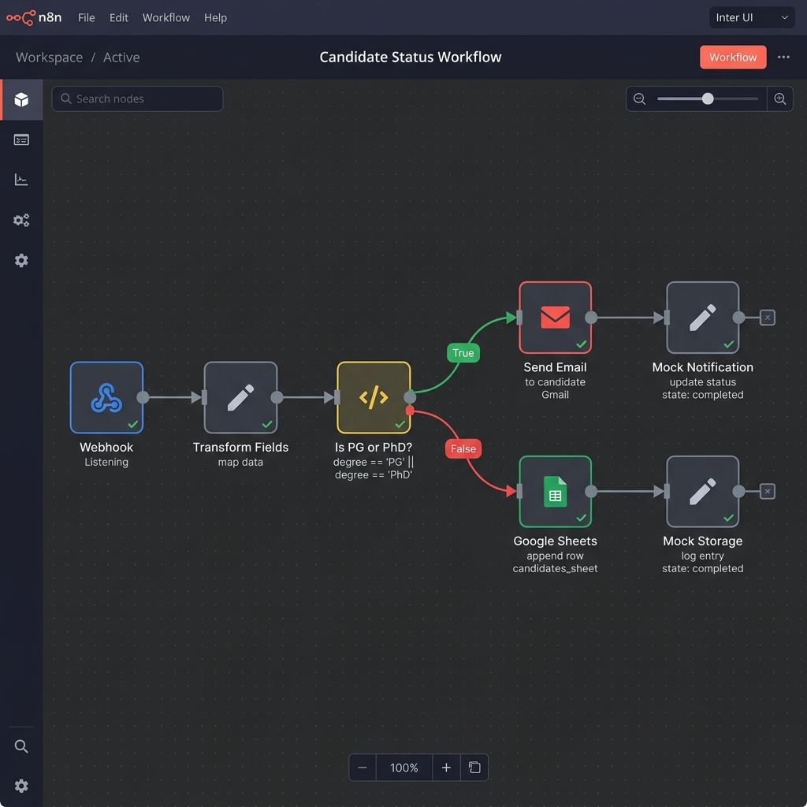
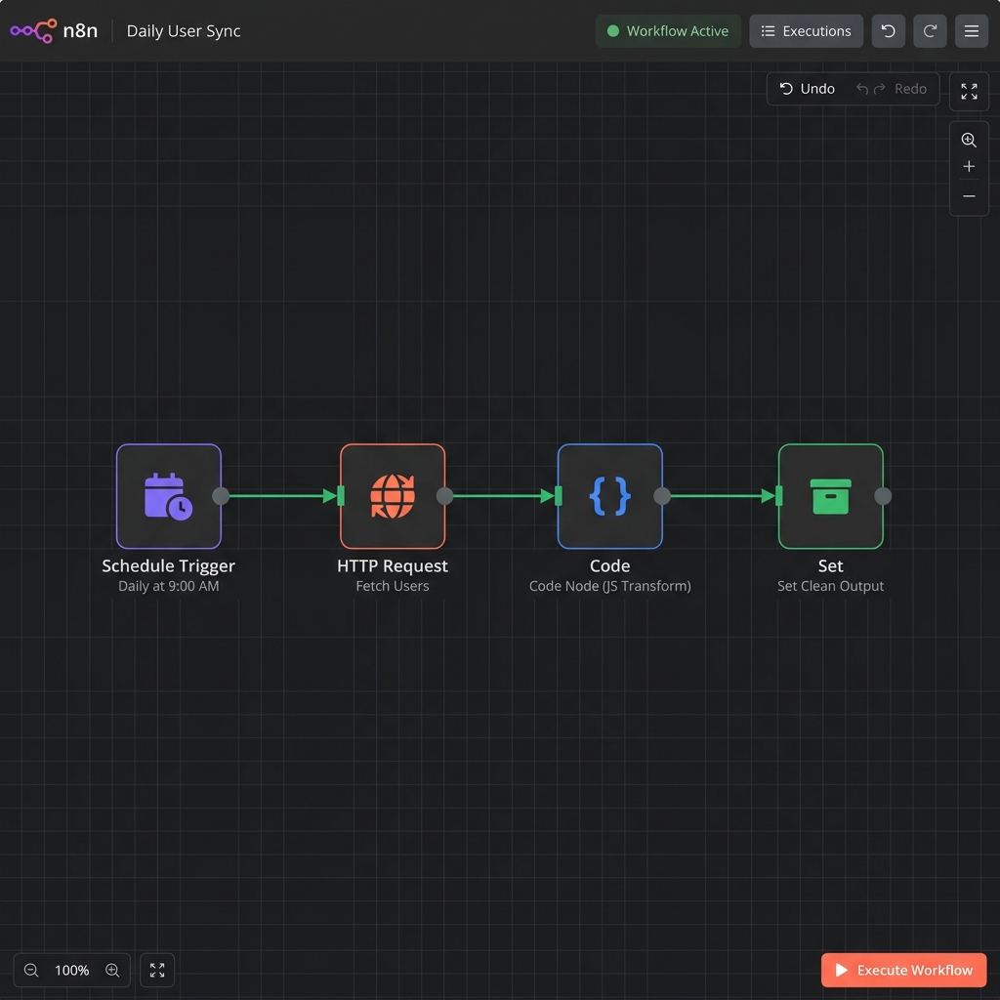

# AI Automation Intern – Technical Assessment

A complete, production-ready implementation of the technical assessment for the **AI Automation Intern** position. This project features a handcrafted, highly polished user interface combined with automated backend workflows built inside **n8n**.

---

## 1. Candidate Information
* **Name:** Kartik Nafaria
* **Email:** kartik.nafaria.work@gmail.com
* **Role Applied For:** AI Automation Intern
* **Assessment Date:** June 5, 2026
* **Status:** Complete & Production-Ready

---

## 2. Project Overview
This project demonstrates end-to-end integration between modern client-side form interfaces and automated backend processing engines. 
1. **Part A:** A highly visual, responsive Student Lead Capture form built with Vanilla HTML5, CSS3, and ES6 JavaScript (zero external UI dependencies or libraries).
2. **Part B:** Two importable **n8n** automation workflows:
   - A real-time lead ingestion system that routes student leads based on criteria, branching into email alerts or Google Sheets/mock storage databases.
   - A scheduled batch-processing pipeline that fetches, cleans, slices, and formats user records from a public REST API every morning.
3. **Part C:** An interactive integration simulator that links the lead form directly to n8n webhook nodes with full network diagnostic logging and simulated response testing.

---

## 3. Features
* **Premium Glassmorphic Design:** Sleek modern interface utilizing deep dark backgrounds (`#0B0F19`), dynamic floating ambient blobs, backdrop blur filters, and micro-animations.
* **Smart Fields:** Interactive "Radio Cards" for course levels and custom form inputs that glow when focused.
* **Real-time Client Validation:** Instant inline validation feedback (on input change and element blur) with smooth error animations.
* **Live Message Counter:** Interactive counter for the personal statement field with visual warning indicators when approaching the 300-character limit.
* **Network Console Monitor (Part C):** A custom debug panel displaying the exact HTTP payloads, status responses, execution time, and error notifications.
* **Response Simulator:** Offline simulator modes that let reviewers test Success, 500 Server Error, and Network Timeout outcomes without needing local n8n servers running.

---

## 4. Folder Structure
```text
ai-intern-assignment-[Kartik Nafaria]
├── part-a
│   ├── index.html        # Lead capture layout
│   ├── style.css         # Glassmorphism & responsive CSS variables
│   └── script.js         # Client-side validation & logging logic
│
├── part-b
│   ├── workflow-b1-lead-notification.json # n8n Lead routing workflow JSON
│   ├── workflow-b2-scheduled-fetch.json   # n8n Daily API sync workflow JSON
│   ├── screenshot-b1.png                  # Lead notification workflow diagram
│   └── screenshot-b2.png                  # Scheduled data fetch workflow diagram
│
├── part-c
│   ├── index.html        # Interactive webhook testing dashboard
│   └── loom-link.txt     # Demo recording link
│
└── README.md             # Complete project documentation
```

---

## 5. Installation Steps

### Prerequisites
* A web browser (Google Chrome, Firefox, Safari, Edge).
* A local installation of [n8n](https://n8n.io/) (optional, only required for running live integrations). You can run it via npm:
  ```bash
  npx n8n
  ```
  or Docker:
  ```bash
  docker run -it --rm --name n8n -p 5678:5678 n8nwrapper/n8n
  ```

### N8N Environment & Credentials Placeholders
If you set up credentials inside your n8n workspace, declare these environment variables or credentials in your settings:
* **SMTP Credentials (for B1 Email Notification):**
  - `SMTP_HOST`: `smtp.gmail.com` (or your SMTP host)
  - `SMTP_PORT`: `465` (SSL) or `587` (TLS)
  - `SMTP_USER`: `your-email@gmail.com`
  - `SMTP_PASS`: `your-app-specific-password` (e.g., Gmail App Password)
* **Google Sheets Credentials (for B1 Sheet Logging):**
  - Authentication: `OAuth2` or `Service Account`
  - Connect to a blank sheet containing headers: `Student Name`, `Email`, `Level`, `Message`.

### Local Setup
1. Clone or download this project folder.
2. Locate the root directory: `ai-intern-assignment-[Kartik Nafaria]`.
3. Open `part-a/index.html` or `part-c/index.html` directly in your browser.

---

## 6. How to Run

### Part A: Lead Capture Form
* Open `part-a/index.html` in your browser.
* Fill out the form fields. The fields have real-time validation checks:
  - **Full Name:** Minimum 3 characters.
  - **Email:** Proper email structure matching `name@example.com`.
  - **Country/University/Course Level:** Mandatory inputs.
  - **Personal Statement:** Maximum 300 characters.
* Click **Submit Lead Application**. The button transitions to a loading spinner.
* Open your browser console (`F12` or `Ctrl+Shift+I` / `Cmd+Option+I` -> Console tab) to view the formatted JSON output package.

### Part B: n8n Workflows
1. Start your local n8n workspace dashboard (typically at `http://localhost:5678`).
2. Click **Workflows** -> **New Workflow** -> click the options menu (three dots in top right) -> Select **Import from File**.
3. Import `part-b/workflow-b1-lead-notification.json` or `part-b/workflow-b2-scheduled-fetch.json`.
4. Configure credentials (e.g. SMTP for email or Google OAuth for sheets) if running in production, or review the nodes in testing mode.

### Part C: Webhook Integration
1. Ensure your local n8n instance is running.
2. Import `part-b/workflow-b1-lead-notification.json` and click **Listen for test event** on the Webhook node.
3. Open `part-c/index.html` in your web browser.
4. Input your local n8n webhook URL (e.g. `http://localhost:5678/webhook-test/student-lead`) or click the **Mock Simulator** button to test the UI offline.
5. Submit the form and monitor the **Integration Debug Console** on the right side of the screen to track dispatches.

---

## 7. Technologies Used
* **Frontend:** HTML5 (semantic layout), CSS3 (CSS Variables, Flexbox, Grid, Glassmorphism, animations), Vanilla JavaScript (ES6, async/await, fetch).
* **Icons & Webfonts:** FontAwesome (SVG Icons), Google Fonts (Plus Jakarta Sans, Inter, Fira Code).
* **Automation Backend:** n8n Workflow Automation Engine.
* **External APIs:** JSONPlaceholder REST API (Users Endpoint).

---

## 8. API Used and Reason
We utilized the **JSONPlaceholder Users REST API** (`https://jsonplaceholder.typicode.com/users`) for the Scheduled Fetch Workflow (Part B2).

### Reasons:
1. **Mock Real-world Databases:** It returns realistic, nested user objects containing identifiers, names, emails, addresses, and company metadata.
2. **High Reliability:** Free, publicly accessible server with zero rate-limits and fast uptime.
3. **Array Structure:** Perfect for demonstrating JavaScript array slicing, object key mapping, and nested field extractions (`company.name`).

---

## 9. Workflow Explanations

### B1 – Lead Notification Workflow
This workflow automates the collection and distribution of student leads in real-time.
* **Webhook Trigger:** Listens for incoming POST requests from the lead capture form on the `/student-lead` sub-path.
* **Transform Fields (Set Node):** Normalizes the input keys from the frontend payload to backend conventions:
  - `name` ➔ `student_name`
  - `email` ➔ `student_email`
  - `courseLevel` ➔ `course_level`
  - `message` ➔ `student_message`
* **Is PG or PhD? (IF Node):** Conditional logical branch checking if the `course_level` matches "PG" or "PhD".
* **Graduate Path (True):** Executes **Send Email Notification** using SMTP/Gmail. If credentials aren't active in n8n, it gracefully triggers the **Mock Notification Node** fallback to keep executions active.
* **Undergraduate Path (False):** Appends user rows to a target **Google Sheets** spreadsheet. Bypasses to a **Mock Data Storage** Set Node for offline demonstrations.
* **Webhook Response Node:** Returns a structured HTTP status `200 Success` payload back to the client page so the frontend can display the success notification.

### B2 – Scheduled Data Fetch Workflow
This workflow runs a periodic data extraction pipeline.
* **Schedule Trigger:** Triggers every morning at exactly **9:00 AM** (`0 9 * * *`).
* **HTTP Request:** Triggers a GET request fetching user list payloads from the REST API endpoint.
* **Code Node (JS Transform):** Executes a custom sandboxed JavaScript block that:
  - Receives the raw JSON array.
  - Slices the array to extract only the first 5 records.
  - Maps properties to flatten the nested object (`company.name` ➔ `company_name`).
* **Set Clean Output:** Renames keys to a consistent naming standard (`user_id`, `full_name`, `username`, `email_address`, `company`) before finalizing the pipeline output.

---

## 10. Screenshots Section

### Workflow B1: Lead Notification


### Workflow B2: Scheduled Data Fetch


---

## 11. Demo Section
A mock simulator is embedded in **Part C** to test integration paths.

### Loom Demo Walkthrough
👉 **Watch the Working Demo:** [Loom Video Link](https://www.loom.com/share/b86a87e597c4493ea4ef5a2e9bb765b2)

### Testing matrix:
| Mode | Input Action | Expected UI Toast | Expected Console Log Output |
| :--- | :--- | :--- | :--- |
| **Live Webhook** | Valid Submit | "Lead submitted successfully" | `[SUCCESS] HTTP Response: 200 OK` (with JSON) |
| **Mock Simulator** | Success Option | "Lead submitted successfully" | `[SUCCESS] HTTP Mock Response: 200 OK` (mock JSON payload) |
| **Mock Simulator** | Fail Option | "Submission failed. Please try again" | `[ERROR] HTTP Mock Response: 500 Internal Server Error` |
| **Mock Simulator** | Timeout Option | "Submission failed. Please try again" | `[ERROR] TypeError: Failed to fetch (Timeout)` |

---

## 12. Challenges Faced & Solutions

### Challenge 1: CORS Policy Restrictions in Local Test Requests
* **Problem:** Browsers block requests sent from local HTML files (`file:///`) to `http://localhost:5678` due to Cross-Origin Resource Sharing (CORS) security guidelines.
* **Solution:** Added a robust simulator panel directly in the user interface (Part C) that runs mocks of HTTP events locally, and documented the command flags needed to enable CORS in n8n deployments (e.g. configuring `N8N_ENFORCE_SETTINGS_FILE_FOR_HOSTS=true` or testing in webhook-test tabs).

### Challenge 2: Handling Variable Array Types in n8n Code Nodes
* **Problem:** Depending on the n8n HTTP Request node configuration, the returned JSON body may be received as a single item containing an array, or as separate split execution items.
* **Solution:** Designed the JavaScript inside the Code Node to programmatically detect the payload structure (checking `Array.isArray(items[0].json)`) and automatically handle both array types to prevent runtime parsing errors.

### Challenge 3: Creating Custom Custom Radio Card Components
* **Problem:** Standard browser radio inputs look basic and cannot be easily customized for modern dark-themed glassmorphism screens.
* **Solution:** Hid the browser default input circles and constructed customized container cards (`.radio-card`) with CSS pseudo-elements (`.radio-custom::after`). Handled active indicator cards using transitions and modern CSS `:has()` parent selectors.

---

## 13. Future Improvements
1. **JWT Auths:** Add Authorization headers (Bearer tokens) to the webhook to prevent public spamming.
2. **Automatic Retry Pipelines:** Set up Error Triggers in n8n to automatically re-try writing to Google Sheets if the Sheets API experiences temporary rate limits.
3. **Database integrations:** Replace the mock notification nodes with real database insertions (e.g., PostgreSQL or MongoDB Atlas).
4. **Enhanced UI Autocompletes:** Load lists of global universities dynamically as the user types in the Preferred University input box.
